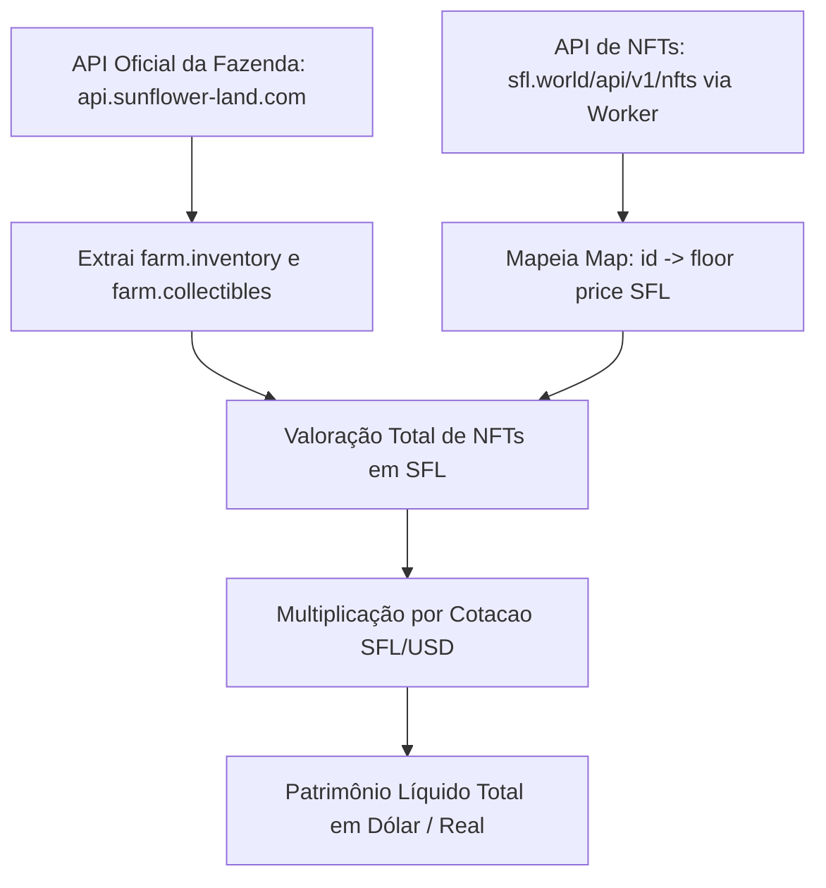

---
tags:
  - sfl/nfts
  - documentation/api
  - reference/pricing
  - collectibles/wearables
---

# 🎨 SFL - Documentação de Preços de NFTs e Floor Price (`/api/v1/nfts`)

Documentação técnica do endpoint de cotações, preços mínimos (*floor price*), histórico de vendas e bônus (*boosts*) de NFTs do ecossistema Sunflower Land via `sfl.world`.

---

## 📌 Visão Geral do Endpoint

O endpoint `https://sfl.world/api/v1/nfts` agrega e indexa em tempo real todas as ordens de compra e venda ativas dos Smart Contracts de NFTs (colecionáveis e vestíveis ERC-1155 / ERC-721 na Polygon).

| Atributo | Descrição |
| :--- | :--- |
| **Endpoint Direto** | `https://sfl.world/api/v1/nfts` |
| **Acesso via Worker (CORS)** | `https://sfltrade.asaphgabrielsousa.workers.dev/?url=https%3A%2F%2Fsfl.world%2Fapi%2Fv1%2Fnfts` |
| **Método HTTP** | `GET` |
| **Autenticação** | Nenhuma (Endpoint público) |
| **Frequência de Atualização** | Periódica (~15 a 30 minutos via indexador on-chain) |

---

## 📦 Estrutura de Resposta (JSON)

A resposta raiz contém 3 propriedades fundamentais:

```json
{
  "collectibles": [ ... ],
  "wearables": [ ... ],
  "updatedAt": 1788217170091
}
```

### 1. Dicionário de Campos (Schema)

Tanto os objetos dentro de `collectibles` quanto de `wearables` compartilham rigorosamente a mesma estrutura:

| Campo | Tipo | Descrição | Exemplo |
| :--- | :--- | :--- | :--- |
| `id` | `number` | ID único do item NFT no Sunflower Land | `1205`, `2129`, `523` |
| `name` | `string` | Nome legível do NFT (quando disponível) | `"Chef Bear"`, `"Stone Beetle"` |
| `floor` | `number` | Menor preço de venda ativo no marketplace (em SFL) | `0.0023`, `0.1`, `2.5` |
| `lastSalePrice` | `number` | Valor da última venda confirmada on-chain (em SFL) | `0.0022`, `0.1158` |
| `supply` | `number` | Quantidade total cunhada/em circulação | `17073`, `446` |
| `collection` | `string` | Categoria do token (`"collectibles"` ou `"wearables"`) | `"collectibles"` |
| `have_boost` | `number` | Flag indicativa de bônus (`1` = tem boost, `0` = decorativo) | `1`, `0` |
| `boost_text` | `string` | Descrição do efeito/buff proporcionado pelo item no jogo | `"+0.1 Stone"`, `"+1 Fishing minigame attempt"` |

---

## 🔍 Exemplos Práticos de Itens

### 1. Colecionável Decorativo (Sem Boost)
```json
{
  "id": 1205,
  "floor": 0.0023,
  "lastSalePrice": 0.0022,
  "supply": 17073,
  "collection": "collectibles",
  "name": "Chef Bear",
  "have_boost": 0,
  "boost_text": ""
}
```

### 2. Colecionável Utilitário (Com Boost de Produção)
```json
{
  "id": 2129,
  "floor": 0.1,
  "lastSalePrice": 0.1,
  "supply": 0,
  "collection": "collectibles",
  "name": "Stone Beetle",
  "have_boost": 1,
  "boost_text": "+0.1 Stone"
}
```

### 3. Vestível do Bumpkin (Wearable)
```json
{
  "id": 523,
  "floor": 0.0999,
  "lastSalePrice": 0.1,
  "supply": 1841,
  "collection": "wearables",
  "name": "Fish Hook Hat",
  "have_boost": 0,
  "boost_text": ""
}
```

---

## 💡 Como Integrar no SflTrade (Valoração de Patrimônio Líquido em NFTs)

Atualmente o **SflTrade** calcula o inventário de recursos físicos (colheitas, sementes, minérios). Com esse endpoint de NFTs, torna-se possível calcular a **Valoração Completa da Fazenda (Total Farm Net Worth)**:



### Algoritmo Sugerido para Valoração:
```javascript
export function calculateNftValuation(farmCollectibles = {}, nftPrices = []) {
  const priceMap = new Map();
  nftPrices.forEach(nft => {
    if (nft.name) priceMap.set(nft.name.toLowerCase(), Number(nft.floor || 0));
    if (nft.id) priceMap.set(String(nft.id), Number(nft.floor || 0));
  });

  let totalSflValue = 0;
  const items = [];

  Object.entries(farmCollectibles).forEach(([itemName, placements]) => {
    const count = Array.isArray(placements) ? placements.length : Number(placements || 0);
    const floorPrice = priceMap.get(itemName.toLowerCase()) || 0;
    const totalItemValue = count * floorPrice;

    if (count > 0) {
      totalSflValue += totalItemValue;
      items.push({
        name: itemName,
        count,
        floorPrice,
        totalSflValue
      });
    }
  });

  return { totalSflValue, items };
}
```

---

## 🛡️ Resiliência & Consumo via Cloudflare Worker

Para evitar problemas de CORS no navegador móvel e desktop, o consumo deve ser feito via proxy cadastrado:

```javascript
import { fetchWithFallback } from './api';

export async function fetchNftPrices() {
  const targetUrl = 'https://sfl.world/api/v1/nfts';
  return await fetchWithFallback(targetUrl);
}
```
