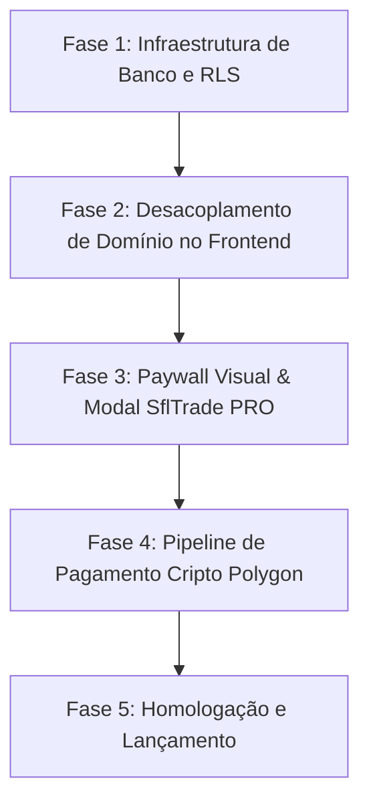

# Documento de Engenharia & Planejamento em Cascata — Monetização SflTrade PRO

> **Status:** Proposta Técnica & Especificação de Requisitos  
> **Data de Elaboração:** 2026-09-14  
> **Autor:** Antigravity AI & Arquiteto de Software  
> **Versão:** 1.0.0  

---

## 1. Visão Geral e Alinhamento Estratégico

O objetivo deste projeto é introduzir um modelo de monetização sustentável para o **SflTrade** através da assinatura **SflTrade PRO**, garantindo retenção, transparência e proteção contra rejeição da comunidade.

### 1.1 Premissas Estratégicas
1. **Transparência Prévia com Free Trial:** Em vez de lançar o produto 100% gratuito e impor uma cobrança abrupta posteriormente (o que geraria atrito com a comunidade), o sistema anunciará o modelo PRO desde o primeiro dia, oferecendo **14 dias de teste gratuito (Free Trial)** automático para todos os novos usuários cadastrados.
2. **Geração de Hábito e Dependência de Valor:** Durante os 14 dias, o usuário tem acesso irrestrito às ferramentas analíticas avançadas (séries históricas de 7D, 30D e 90D e Destaques de Mercado). Quando o trial expira, o retorno sobre o investimento (ROI) já foi percebido pelo trader.
3. **Preço Acessível e Alta Margem:** O valor alvo sugerido situa-se entre **$1.00 USD e $1.50 USD por mês** (equivalente a aproximadamente 1.2 a 2.0 POL ou 0.0004 a 0.0006 ETH), pago diretamente em criptomoeda.

---

## 2. Estudo Comparativo de Viabilidade de Redes: Base vs Ronin vs Polygon

### 2.1 Contexto Econômico Atual do Sunflower Land
Historicamente o Sunflower Land utilizava o token $SFL na rede Polygon. No entanto, a economia do jogo evoluiu para o token **$FLOWER**, com suporte oficial e nativo para saques e depósitos nas redes **Base (Ethereum L2)** e **Ronin (Sidechain EVM)**. 
O termo "SFL" permanece em uso pela comunidade apenas como convenção de linguagem e marca legada.

| Critério de Análise | Rede Base (Ethereum L2) | Rede Ronin (Sidechain EVM) | Rede Polygon PoS (Legada) | Veredito Técnico |
| :--- | :--- | :--- | :--- | :--- |
| **Integração com $FLOWER** | **Nativa.** Suporte oficial do jogo para saques de $FLOWER. | **Nativa.** Suporte oficial do jogo para saques de $FLOWER. | Legada. Transição de liquidez para Base/Ronin. | **Base e Ronin dominam a economia ativa.** |
| **Saldo Disponível do Usuário** | **Excelente.** Jogadores que sacam e negociam $FLOWER já mantêm saldo em ETH/USDC/FLOWER na Base. | Alto para quem usa o ecossistema Ronin/Axie. | Decrescente para movimentação de moeda líquida. | **Base é a L2 mais líquida e comum.** |
| **Taxas de Rede (Gas)** | **Ultra-baixas:** ~$0.001 a $0.004 por transação (após blobs EIP-4844). | Praticamente zero (rede subsidiada/especializada). | ~$0.005 a $0.015 por transação. | **Base oferece equilíbrio perfeito de liquidez e gas irrisório.** |
| **Apoio de Infraestrutura** | **Máximo.** Suportada por Coinbase Commerce, NOWPayments, Alchemy, Infura, BaseScan. | Suporte mais restrito em gateways comerciais de pagamento. | Amplo. | **Base é infinitamente mais fácil de integrar com Webhooks e RPC.** |

### 2.2 Conclusão de Engenharia de Rede:
A **Rede Base** é a **escolha prioritária (#1)** para o recebimento de pagamentos do SflTrade PRO.
- O jogador de Sunflower Land atual já interage com a Base para liquidar e sacar seus tokens **$FLOWER**.
- O custo de transação na Base é insignificante (< $0.005).
- A infraestrutura de APIs (NOWPayments, Coinbase Commerce, Alchemy Base RPC) é de nível institucional.
- A **Rede Polygon** permanece como opção secundária/contingência, e **Ronin** é mapeada para expansão futura.

---

## 3. Ontologia e Modelagem de Domínio

Durante a auditoria do código, identificou-se uma distinção de domínio fundamental que precisa ser rigorosamente respeitada:

1. **`in_game_vip` (VIP do Sunflower Land):**
   - Refere-se à bandeira/passe VIP existente dentro do próprio jogo Sunflower Land.
   - Concede 50% de desconto sobre as taxas da ilha ativa (conforme documentado em `docs/Tax_Rules.md`).
   - É configurado no Header pelo usuário e armazenado em `user_settings.vip_active`.
   - **Não deve ser confundido nem sobrescrito pelo plano PRO.**

2. **`sfltrade_pro` (Assinatura da Plataforma SflTrade):**
   - Refere-se ao acesso premium da nossa ferramenta analítica.
   - Desbloqueia os timeframes `7D`, `30D`, `90D` nos gráficos e nos cards de Destaques de Mercado.
   - Deve ser controlado em uma tabela separada (`user_subscriptions`) com autoridade restrita ao servidor.

---

## 4. Análise de Arquitetura de Pagamentos: Opções de Implementação

### Método A: Gateway Não-Custodial via API (NOWPayments / Coinbase Commerce) — *Recomendado*
- **Funcionamento:** O backend (Supabase Edge Function) consome a API do gateway para gerar uma fatura com endereço temporário dedicado na **Rede Base** (suportando ETH, USDC ou FLOWER). O usuário transfere o valor para aquele endereço. O gateway monitora a rede, realiza o sweeping automático para a carteira mestre do desenvolvedor e aciona um Webhook autenticado para o Supabase.
- **Vantagens:** Não exige custódia de chaves privadas; Webhook com assinatura criptográfica; tratamento automático de sub-pagamentos e over-payments.
- **Custo:** 0.5% a 1% da transação + taxa de gas de sweep insignificante na Base (< $0.005).

### Método B: Carteira Mestre Única + Validação On-Chain por TX Hash na Base
- **Funcionamento:** O site exibe a carteira pública do desenvolvedor na Rede Base. O usuário envia ETH/USDC de qualquer carteira e cola o Transaction Hash no site. O backend consulta o RPC da Base (via BaseScan API ou Alchemy RPC público), valida o remetente, destinatário, valor e número de confirmações.
- **Vantagens:** Custo zero absoluto em intermediários; dinheiro 100% direto na carteira mestre.
- **Desvantagens:** Exige que o usuário copie e cole o hash da transação manualmente.

### Método C: Geração Autônoma de Endereços Únicos (Custodial / HD Wallet)
- **Funcionamento:** O backend deriva endereços a partir de uma chave mestra estendida (xpub). Um cron varre blocos buscando transações nos endereços e executa transações de varredura (sweeping).
- **Desvantagens:** Requer gerenciamento e custódia de chaves privadas, saldo de gas pré-alocado em cada carteira filha para o sweep, e infraestrutura de nós/workers 24/7. **Descartado devido a riscos de segurança e complexidade desproporcional.**

---

## 5. Especificação de Requisitos (Engenharia Formal)

### 5.1 Requisitos Funcionais (RF)
- **RF-01 (Provisionamento de Trial):** Ao criar uma conta ou autenticar-se pela primeira vez via Supabase Auth, o sistema deve registrar automaticamente um período de teste de 14 dias (`trial_ends_at = NOW() + INTERVAL '14 days'`).
- **RF-02 (Gatekeeping de Séries Temporais):** Os seletores de intervalo `7D`, `30D` e `90D` nos componentes `PriceChartModal` e `MarketMoversCards` devem ser bloqueados para usuários cujo status PRO não seja ativo (`is_pro = false`).
- **RF-03 (Sinalização Visual de Bloqueio):** Botões com restrição PRO devem apresentar indicador visual de cadeado ou tag indicativa, preservando a usabilidade do botão `24h` (gratuito para todos).
- **RF-04 (Modal de Conversão / Status PRO):** Ao acionar uma funcionalidade restrita, o sistema deve exibir modal informativo contendo:
  - Se Trial Ativo: quantidade de dias restantes e chamada para aproveitar o período.
  - Se Trial Expirado: valor da assinatura mensal, instruções e geração de cobrança em ETH/USDC na Rede Base (ou POL na Polygon como secundária).
- **RF-05 (Geração e Verificação de Cobrança):** O sistema deve fornecer mecanismo de pagamento na Rede Base com monitoramento e liberação automática em até 5 minutos após confirmação on-chain.
- **RF-06 (Extensão de Assinatura):** Pagamentos confirmados devem adicionar 30 dias ao campo `pro_expires_at` do usuário de forma idempotente.

### 5.2 Requisitos Não-Funcionais (RNF)
- **RNF-01 (Segurança Inegociável - Fonte Única da Verdade):** O status PRO do usuário deve ser validado no servidor via Row Level Security (RLS) ou Edge Functions no Supabase. Nenhuma flag persistida no `localStorage` ou estado de cliente pode conceder acesso a dados restritos.
- **RNF-02 (Integridade Transacional e Idempotência - ACID):** Cada transação blockchain processada deve ser gravada em tabela de auditoria (`payment_transactions`) com restrição de unicidade sobre o Hash da transação (`tx_hash UNIQUE`), prevenindo reuso de pagamentos (ataque de replay).
- **RNF-03 (Performance e Latência):** A verificação de status PRO no carregamento da aplicação deve ser cacheada na sessão ativa para não onerar o tempo de renderização do dashboard.
- **RNF-04 (Zero Emojis em Código e Queries):** Em conformidade com o Código de Regência de Yggdrasil, nenhum código-fonte, query SQL ou interface de sistema deve conter emojis Unicode.

---

## 6. Modelagem de Banco de Dados (Supabase / PostgreSQL)

### 6.1 Nova Tabela: `public.user_subscriptions`
```sql
CREATE TABLE IF NOT EXISTS public.user_subscriptions (
    user_id UUID PRIMARY KEY REFERENCES auth.users(id) ON DELETE CASCADE,
    trial_started_at TIMESTAMPTZ NOT NULL DEFAULT NOW(),
    trial_ends_at TIMESTAMPTZ NOT NULL DEFAULT (NOW() + INTERVAL '14 days'),
    pro_expires_at TIMESTAMPTZ,
    status TEXT NOT NULL DEFAULT 'trial' CHECK (status IN ('trial', 'active', 'expired', 'canceled')),
    created_at TIMESTAMPTZ NOT NULL DEFAULT NOW(),
    updated_at TIMESTAMPTZ NOT NULL DEFAULT NOW()
);
```

### 6.2 Nova Tabela: `public.payment_transactions`
```sql
CREATE TABLE IF NOT EXISTS public.payment_transactions (
    id UUID PRIMARY KEY DEFAULT gen_random_uuid(),
    user_id UUID NOT NULL REFERENCES auth.users(id) ON DELETE CASCADE,
    tx_hash TEXT NOT NULL UNIQUE,
    network TEXT NOT NULL DEFAULT 'base',
    currency TEXT NOT NULL DEFAULT 'ETH',
    amount_crypto NUMERIC(18, 8) NOT NULL,
    amount_usd NUMERIC(10, 2) NOT NULL,
    status TEXT NOT NULL DEFAULT 'confirmed' CHECK (status IN ('pending', 'confirmed', 'failed')),
    created_at TIMESTAMPTZ NOT NULL DEFAULT NOW()
);
```

### 6.3 Trigger Automático para Novos Usuários
Um gatilho (*trigger*) atrelado à tabela `auth.users` garante que qualquer novo cadastro receba automaticamente seu registro com os 14 dias de teste sem depender de chamadas manuais no frontend:
```sql
CREATE OR REPLACE FUNCTION public.handle_new_user_subscription()
RETURNS TRIGGER AS $$
BEGIN
    INSERT INTO public.user_subscriptions (user_id, trial_started_at, trial_ends_at, status)
    VALUES (NEW.id, NOW(), NOW() + INTERVAL '14 days', 'trial')
    ON CONFLICT (user_id) DO NOTHING;
    RETURN NEW;
END;
$$ LANGUAGE plpgsql SECURITY DEFINER;

CREATE OR REPLACE TRIGGER on_auth_user_created_subscription
    AFTER INSERT ON auth.users
    FOR EACH ROW EXECUTE FUNCTION public.handle_new_user_subscription();
```

---

## 7. Roteiro de Implementação em Cascata (Etapas Sequenciais)



### Detalhamento das Etapas:

1. **Fase 1 — Infraestrutura de Banco e RLS (Backend Supabase):**
   - Execução do script DDL com criação de `user_subscriptions` e `payment_transactions`.
   - Implementação da trigger `on_auth_user_created_subscription`.
   - Configuração de políticas de RLS (usuário pode ler sua assinatura, mas apenas `service_role` pode atualizar `pro_expires_at` ou `status`).
   - Remoção do envio de flags de status administrativo pelo frontend no método `syncLocalToSupabase`.

2. **Fase 2 — Desacoplamento de Domínio no Frontend:**
   - Padronizar variáveis: manter `inGameVip` restrito ao cálculo de taxas de venda de itens do jogo.
   - Criar estado dedicado `isProActive` derivado da validação:
     `isPro = (trial_ends_at > NOW()) || (pro_expires_at > NOW())`.
   - Expor o estado PRO para a árvore de componentes através de contexto ou props controladas.

3. **Fase 3 — Paywall Visual & Modal SflTrade PRO:**
   - Adicionar trava nos seletores dos componentes `PriceChartModal.jsx` e `MarketMoversCards.jsx`.
   - Se `!isProActive`: cliques nos botões 7D, 30D e 90D disparam o modal `ProUpgradeModal`.
   - Desenvolver o componente `ProUpgradeModal.jsx` com suporte multilíngue (`pt` e `en`), exibindo:
     - Dias restantes do trial (se ativo).
     - Informações dos benefícios do plano.
     - Botão de ação (Assinar ou Ativar).

4. **Fase 4 — Pipeline de Pagamento Cripto:**
   - Integração com a API de gateway escolhida (NOWPayments) via Edge Function autenticada para emissão de cobranças em POL.
   - Criação da Edge Function de Webhook (`webhook-payment-listener`) para validação e crédito automático de 30 dias na assinatura.
   - Alternativa de contingência integrada: validação on-chain por Hash de transação direta para a carteira do projeto.

5. **Fase 5 — Homologação, Testes e Documentação de Lançamento:**
   - Teste de fluxo completo: Novo registro -> Verificação dos 14 dias -> Simulação de expiração -> Execução de pagamento simulado em testnet/mainnet -> Liberação das séries temporais.
   - Publicação na branch `gh-pages` e elaboração da mensagem de divulgação oficial para os canais do Discord da comunidade.

---

## 8. Matriz de Riscos e Mitigações

| Risco Identificado | Severidade | Probabilidade | Estratégia de Mitigação |
| :--- | :--- | :--- | :--- |
| Usuário tenta burlar via DevTools alterando estado React local. | Alta | Alta | O frontend bloqueia apenas a interface; as views analíticas no Supabase e Edge Functions devem exigir token com claim ativa. |
| Jogador abandona o pagamento por falta de saldo na rede Base. | Média | Alta | Priorização absoluta da **Rede Polygon (POL)** como método principal de recebimento. |
| Replay Attack (mesmo hash enviado para validar contas diferentes). | Crítica | Média | Restrição `tx_hash UNIQUE` em `payment_transactions` com transação ACID estrita. |
| Falha temporária no gateway de pagamento externo. | Média | Baixa | Fallback operacional permitindo inserção do hash para validação on-chain direta. |
